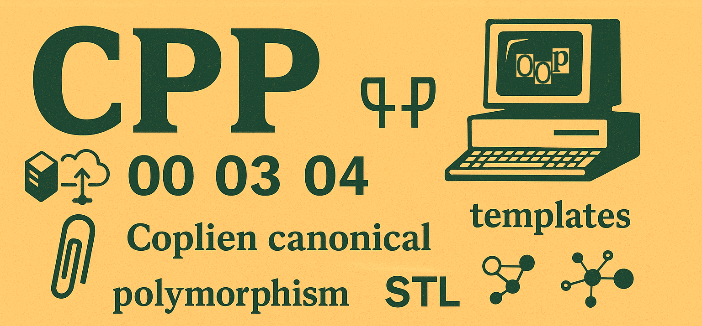
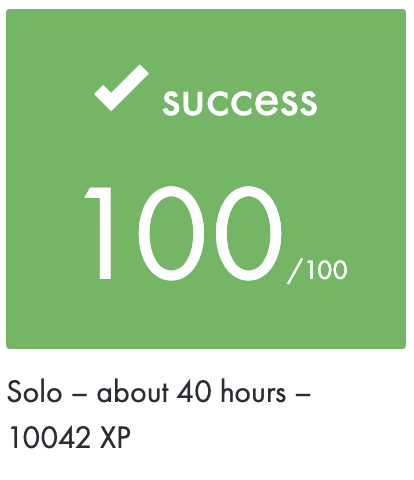
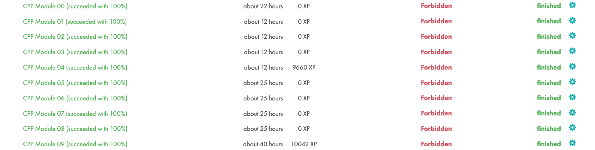

|          Grade          |         Modules          |
|:-----------------------:|:------------------------:|
|  |  |

<br>

---

<details>
<summary>🇫🇷 FRENCH VERSION</summary>

<p align="center">
	Ce projet regroupe tous les modules C++ réalisés à l’école 42, terminés en mars 2025.
</p>

## Préambule
Ce cursus couvre les bases et les concepts avancés de la programmation orientée objet en C++, en respectant la norme C++98. Chaque module introduit une nouvelle notion à travers des exercices pratiques : `héritage`, `polymorphisme`, `exceptions`, `templates`, `STL`, etc.

## Modules abordés et compétences :
- <a href="./Module_00/subject/C++Module00.fr.subject.pdf">**Module 00**</a> : `classes`, `fonctions membres`, `const/static`
- <a href="./Module_01/subject/C++Module01.fr.subject.pdf">**Module 01**</a> : allocation `dynamique`, `références`, `pointeurs` sur membres
- <a href="./Module_02/subject/C++Module02.fr.subject.pdf">**Module 02**</a> : forme `canonique de Coplien`, `surcharge` d’opérateurs
- <a href="./Module_03/subject/C++Module03.en.subject.pdf">**Module 03**</a> : `héritage` simple
- <a href="./Module_04/subject/C++Module04.fr.subject.pdf">**Module 04**</a> : `classes abstraites`, `polymorphisme`
- <a href="./Module_05/subject/C++Module05.en.subject.pdf">**Module 05**</a> : gestion des exceptions et `hiérarchies` d’erreur
- <a href="./Module_06/subject/C++Module06.en.subject.pdf">**Module 06**</a> : `castings` (`static_cast`, `dynamic_cast`, etc.)
- <a href="./Module_07/subject/C++Module07.en.subject.pdf">**Module 07**</a> : `templates`, fonctions génériques
- <a href="./Module_08/subject/C++Module08.fr.subject.pdf">**Module 08**</a> : Introduction à la `STL`
- <a href="./Module_09/subject/C++Module09.fr.subject.pdf">**Module 09**</a> : Projets concrets avec la `STL` (Bitcoin Exchange, RPN, PmergeMe)

## Installation :
```bash
git clone https://github.com/N0fish/CPP.git
cd CPP
```
## Usage
```bash
cd Module_**/ex**
make && ./program
```
## error checking
```bash
valgrind --track-origins=yes --leak-check=full --show-leak-kinds=all ./program
```

</details>

---

<details>
<summary>🇬🇧 ENGLISH VERSION</summary>

<p align="center">
	This repository gathers all the C++ Modules completed at 42 School, finished in March 2025.
</p>

## Preamble
The C++ modules curriculum covers both foundational and advanced concepts of Object-Oriented Programming in C++, strictly adhering to the C++98 standard. Each module introduces a new concept through practical exercises such as `inheritance`, `polymorphism`, `exception handling`, `templates`, `STL`, etc.

## Covered Modules and skills:
- <a href="./Module_00/subject/C++Module00.en.subject.pdf">**Module 00**</a>: `classes`, `member functions`, `const/static`
- <a href="./Module_01/subject/C++Module01.en.subject.pdf">**Module 01**</a>: `references`, dynamic `memory`, member `pointers`
- <a href="./Module_02/subject/C++Module02.en.subject.pdf">**Module 02**</a>: `Coplien canonical` form, operator `overloading`
- <a href="./Module_03/subject/C++Module03.en.subject.pdf">**Module 03**</a>: single `inheritance`
- <a href="./Module_04/subject/C++Module04.en.subject.pdf">**Module 04**</a>: `abstract classes`, `polymorphism`
- <a href="./Module_05/subject/C++Module05.en.subject.pdf">**Module 05**</a>: exceptions and error `hierarchies`
- <a href="./Module_06/subject/C++Module06.en.subject.pdf">**Module 06**</a>: `casting` (`static_cast`, `dynamic_cast`, etc.)
- <a href="./Module_07/subject/C++Module07.en.subject.pdf">**Module 07**</a>: `templates` and generic programming
- <a href="./Module_08/subject/C++Module08.en.subject.pdf">**Module 08**</a>: Introduction to the `STL`
- <a href="./Module_09/subject/C++Module09.en.subject.pdf">**Module 09**</a>: Practical `STL` usage (Bitcoin Exchange, RPN, PmergeMe)

## Installation :
```bash
git clone https://github.com/N0fish/CPP.git
cd CPP
```
## Usage
```bash
cd Module_**/ex**
make && ./program
```
## error checking
```bash
valgrind --track-origins=yes --leak-check=full --show-leak-kinds=all ./program
```

</details>

---

<details>
<summary>🇷🇺 RUSSIAN VERSION</summary>

<p align="center">
	Этот репозиторий содержит все C++ модули, выполненные в школе 42, завершённые в марте 2025 года.
</p>

## Преамбула
Модули C++ — это серия упражнений, обучающих объектно-ориентированному программированию на языке C++. Все задания выполняются в рамках стандарта C++98 и включают в себя `классы`, `наследование`, `полиморфизм`, `шаблоны`, `STL` и многое другое.

## Пройденные модули и навыки:
- <a href="./Module_00/subject/C++Module00.en.subject.pdf">**Module 00**</a>: `классы`, `функции-члены`, `const/static`
- <a href="./Module_01/subject/C++Module01.en.subject.pdf">**Module 01**</a>: `ссылки`, динамическая `память`, `указатели` на члены
- <a href="./Module_02/subject/C++Module02.en.subject.pdf">**Module 02**</a>: каноническая `форма Копльена`, `перегрузка` операторов
- <a href="./Module_03/subject/C++Module03.en.subject.pdf">**Module 03**</a>: простое `наследование`
- <a href="./Module_04/subject/C++Module04.en.subject.pdf">**Module 04**</a>: `абстрактные классы`, `полиморфизм`
- <a href="./Module_05/subject/C++Module05.en.subject.pdf">**Module 05**</a>: исключения, `иерархии` ошибок
- <a href="./Module_06/subject/C++Module06.en.subject.pdf">**Module 06**</a>: `приведение` типов (`static_cast`, `dynamic_cast`, и др.)
- <a href="./Module_07/subject/C++Module07.en.subject.pdf">**Module 07**</a>: `шаблоны` и обобщённое программирование
- <a href="./Module_08/subject/C++Module08.en.subject.pdf">**Module 08**</a>: введение в `STL`
- <a href="./Module_09/subject/C++Module09.en.subject.pdf">**Module 09**</a>: практическое использование `STL` (Bitcoin Exchange, RPN, PmergeMe)

## Установка
```bash
git clone https://github.com/N0fish/CPP.git
cd CPP
```
## Запуск
```bash
cd Module_**/ex**
make && ./program
```
## error checking
```bash
valgrind --track-origins=yes --leak-check=full --show-leak-kinds=all ./program
```

</details>

---

<br>
